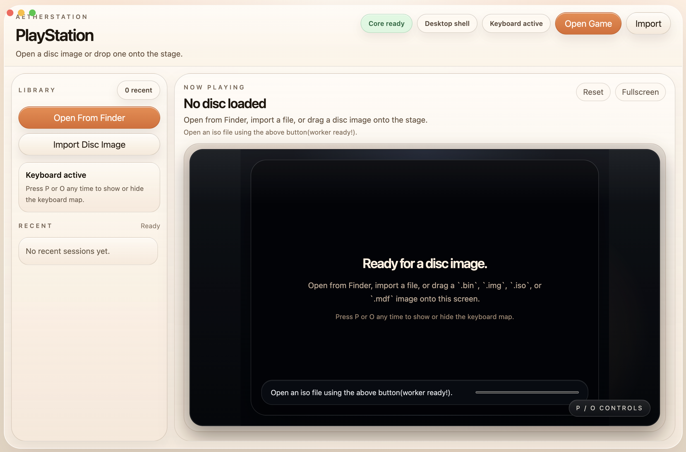
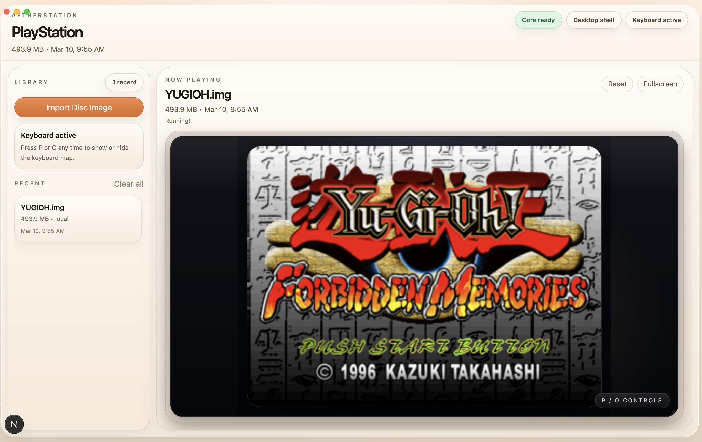

# AetherStation

> *Remember the first time you heard that startup sound? The room goes dark, the logo fades in, and suddenly you're ten years old again — controller in hand, the whole night ahead of you, not a single worry in the world. AetherStation was built to bring that feeling back.*

A love letter to the golden era of PlayStation — wrapped in a modern, Apple-inspired shell. AetherStation is a cross-platform PS1 emulator that runs on macOS, Windows, Linux, and even the web. No setup wizards, no config files, no BIOS hunting. Just drop a disc image and relive the classics.

Built for the ones who still remember their memory card slots. Fully open source, forever free — because nostalgia shouldn't cost a thing.

---

## License

MIT — do whatever you want with it. Fork it, remix it, make it yours. This project exists because some memories are worth preserving, and the best way to preserve them is to share them with everyone.

---

## Showcase

<p align="center">
  
</p>
<p align="center"><em>Yu-Gi-Oh! Forbidden Memories — running smooth, just like you remember it.</em></p>

<br />

<p align="center">
  
</p>
<p align="center"><em>Clean, minimal, ready. Drop a disc and disappear into the past.</em></p>

---

## Why AetherStation?

Because the games that shaped us deserve more than a clunky emulator from 2006. AetherStation gives your childhood favorites a home that feels as polished as the memories themselves.

- **Zero setup** — no BIOS files needed, HLE handles everything
- **Cross-platform** — native desktop app for macOS, Windows, and Linux
- **Web-ready** — deploy as a static site on Vercel, Netlify, or Cloudflare Pages
- **Drag and drop** — toss a `.bin`, `.img`, `.iso`, or `.mdf` onto the screen and play
- **Your saves persist** — memory card data syncs to IndexedDB automatically, your progress survives reloads and sessions
- **Recent library** — your last 6 games, one click away
- **Gamepad native** — plug in a controller and it just works, keyboard fallback built in
- **Fullscreen mode** — one click to lose yourself completely
- **Glass UI** — frosted panels, warm tones, smooth transitions — inspired by modern macOS

---

## Getting Started

### Prerequisites

- [Node.js](https://nodejs.org/) 18 or later
- npm (comes with Node.js)

### Run in Development

```bash
git clone https://github.com/AlleyBo55/psx-emulator-macos-linux-win.git
cd psx-emulator-macos-linux-win
npm install
npm run dev
```

This starts Next.js on `127.0.0.1:3000` and opens the Electron desktop shell automatically.

### Build for Production

```bash
npm run build
npm start
```

### Package as Desktop App

```bash
# Test build (unpacked)
npm run pack

# Full installer (.dmg / .exe / .AppImage)
npm run dist
```

### Deploy to the Web

AetherStation exports as a fully static site — no backend needed.

```bash
npm run build
# Upload the `out/` folder to Vercel, Netlify, Cloudflare Pages, etc.
```

> **Note:** Remove `assetPrefix` in `next.config.ts` when deploying to the web — it's only needed for Electron's relative paths.

---

## Controls

| Action         | Keyboard     |
|----------------|--------------|
| Move           | Arrow keys   |
| Cross (X)      | Z            |
| Circle (O)     | X            |
| Square         | S            |
| Triangle       | D            |
| L1 / L2        | W / E        |
| R1 / R2        | R / T        |
| Select / Start | C / V        |
| Show controls  | P or O       |

Plug in any standard gamepad — it's detected automatically.

---

## Where to Find Games

Browse and download PS1 disc images from [CDRomance](https://cdromance.org/psx-iso/). They have a huge library in `.bin`, `.iso`, `.img`, and `.mdf` formats — all compatible with AetherStation.

---

## Architecture

```
src/app/          → Next.js frontend (React 19, Tailwind CSS 4)
electron/         → Electron main + preload scripts
public/emulator/  → WASM emulator core + bridge layer
vendor/pcsxjs/    → Bundled pcsxjs WebAssembly build
scripts/          → Build-time asset copy scripts
```

The emulator core runs inside an iframe as a Web Worker. The bridge layer handles communication between the React shell and the WASM core via `postMessage`. Save data is persisted through Emscripten's IDBFS — synced every 5 seconds and on tab close.

---

## Tech Stack

| Layer      | Technology                          |
|------------|-------------------------------------|
| Runtime    | Electron 40 · Next.js 16 · React 19 |
| Styling    | Tailwind CSS 4                      |
| Emulation  | pcsxjs 0.0.5 (PCSX WebAssembly)    |
| Packaging  | electron-builder                    |
| Export     | Static HTML via `next export`       |

---

## Legal

- Emulators are legal — see *Sony v. Connectix* and *Sony v. Bleem*
- No copyrighted BIOS or game files are included or distributed
- Users must supply their own legally dumped PS1 disc images
- This project exists for educational and preservation purposes

---

<p align="center"><em>Some nights, all you need is a memory card and a reason to stay up too late.<br/>AetherStation is and always will be free and open source. 🎮</em></p>
